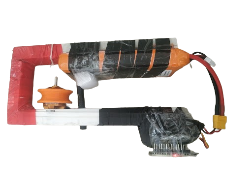

# RoboTraverse 🚀🏆

> **1st Place Winner** at the **RoboTraverse Rope Robotics Challenge** (CSE Robotics Club).  
> **Record Time:** 10 meters traversed in **2.16 seconds** (Average Speed: **4.63 m/s** / **16.6 km/h**).

*Our custom-built lightweight robot featuring a BLDC motor, ESP32, 3S LiPo, and 3D-printed U-grooved wheel.*

---

## 📌 Project Overview
**RoboTraverse** is a custom high-speed rope-traversing bot engineered for manual time-trial competitions. Powered by an **ESP32**, a **Brushless DC (BLDC) motor**, and controlled wirelessly via **Bluetooth Serial**, it delivers high torque and instant acceleration along a suspended rope.

---

## ⚡ Performance Specs & Results

* **Track Length:** 10-15 mtrs (10 meters traversed for record)
* **Best Time:** 2.16 Seconds
* **Weight Limit:** Maximum 500g
* **Rope Material:** Nylon-jute blend
* **Control System:** Manual only (Bluetooth Serial)

---

## 🛠️ Hardware Setup

* **Microcontroller:** ESP32 Dev Module
* **Motor:** Brushless DC (BLDC) Motor
* **ESC:** Electronic Speed Controller (PWM Signal)
* **Power:** 3S 12V LiPo Battery
* **Traction:** Custom 3D-Printed U-Grooved Wheels
* **Frame:** Lightweight Custom Chassis

---

## 🔌 Pinout Table

| Component | ESP32 Pin | Function |
| :--- | :--- | :--- |
| **ESC Signal** | `GPIO 13` | PWM Output Signal (50Hz) |
| **Bluetooth** | Internal Antenna | `BlueToothESP` Wireless Receiver |

---

## 📡 Control Commands

The ESP32 processes single-character commands over Bluetooth Serial (`115200` baud):

* `F` — Start motor and ramp up to target throttle
* `S` — Stop motor immediately (`1000us`)
* `B` — Stop motor (Backward direction disabled)
* `0`–`9` — Map throttle from 0% (`1000us`) to 100% (`2000us`)
* `q` — Set target throttle directly to 100% (`2000us`)
* **Failsafe:** Auto-stops motor if Bluetooth connection drops.

---

## 🚀 Getting Started

1. Open `src/RoboTraverse.ino` in Arduino IDE.
2. Install **ESP32Servo** library via Library Manager.
3. Select **ESP32 Dev Module** under Board Manager.
4. Upload the code to your ESP32.
5. Connect your phone to `BlueToothESP` via any Bluetooth Serial terminal app and send `F` to launch.
